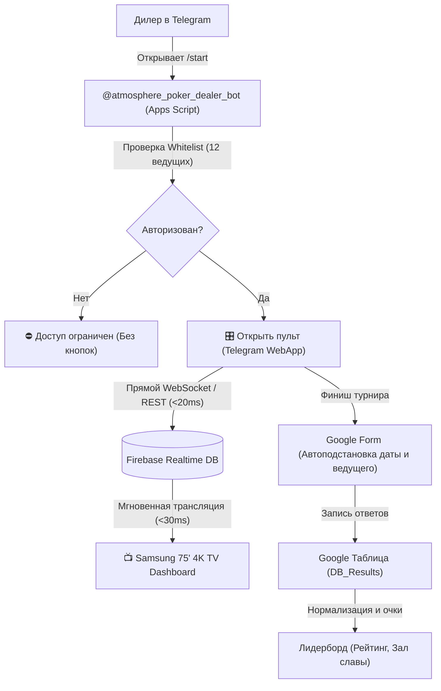

# 🧭 ORCHESTRATOR: Генеральный протокол качества 9.5/10 и архитектурный план
Покерная экосистема «Атмосфера» (ТВ-дашборд 4K, Telegram Mini App ведущего, бот авторизации, Firebase RTDB, Google Apps Script, Таблицы)

---

## 1. Архитектура системы и карта узлов

---

## 2. Глубокий аудит системы: проблемы, нелогичности и решения

### 🚨 1. Кибербезопасность и утечки секретов (GitHub Secret Scanning)
* **Проблема:** Токен Telegram-бота был захардкожен в `shared/poker-config.js`. Поскольку этот файл подключается на клиенте ТВ (`tv/index.html`) и пульта (`dealer/index.html`), токен дилерского бота оказывался в открытом доступе для любого посетителя сайта на GitHub Pages.
* **Решение:**
  1. Полностью удалить `DEALER_BOT_TOKEN` и любые приватные ключи из клиентских файлов (`shared/poker-config.js`, `tv/`, `dealer/`).
  2. Все секреты изолировать в `.env` (для локальных Node.js скриптов) и `PropertiesService.getScriptProperties()` (для Google Apps Script).
  3. Добавить `.env`, `.credentials*`, `*.pem`, `*token*` в `.gitignore`.
  4. Создать защищенный скрипт инициализации свойств `scripts/setup_secrets.js`.

### 🔕 2. Гарантированное устранение спам-пушей каждые 5 минут
* **Проблема:** Бот присылал повторные пуши каждые несколько минут.
* **Причина:**
  1. Telegram Bot API при сбое доставки или перерегистрации вебхука без флага сброса накапливает очередь неотвеченных апдейтов и циклично повторяет их доставку каждые 1–5 минут.
  2. В коде отсутствовала фильтрация устаревших апдейтов (`msg.date < now - 60s`).
* **Решение:**
  1. При регистрации вебхука обязательно передавать `drop_pending_updates: true`.
  2. В `DealerBot.js` игнорировать любые сообщения старше 60 секунд.
  3. Бот должен отвечать **только на команду `/start`** от авторизованного пользователя. Любые другие события, текст или старые апдейты обрабатываются молча с `200 OK`.
  4. Провести аудит и удалить любые остаточные триггеры (`ScriptApp.deleteTrigger`).

### 👤 3. Бесшовное автоопределение ведущего (Zero-Friction Identity)
* **Проблема:** В интерфейсе дилера оставался ручной выбор дилера кнопками-пилюлями, что создавало риск человеческой ошибки.
* **Решение:**
  1. Убрать ручной селектор дилеров из основного боевого интерфейса.
  2. Имя дилера определяется строго автоматически из `Telegram.WebApp.initDataUnsafe.user.username` или `id` через `DEALERS_REGISTRY.MAP`.
  3. В шапке отображается элегантный статичный бейдж: `♠️ Стол ведущего: Влад`.
  4. При открытии вне Telegram (локальная разработка / десктоп) включается аккуратный dev-режим.

### 🃏 4. Структуры блайндов: отказ от колор-апа и 5-минуток
* **Проблема:** В структуре был колор-ап $25/$50 и 5-минутный турбо-пресет, не подходящие под формат антикафе.
* **Решение:**
  1. Убрать из структур колор-ап, заменив раунд 6 на стандартный чистый `ПЕРЕРЫВ (5 мин)`.
  2. Удалить структуру `SNG_TURBO` (5 мин).
  3. Зафиксировать 2 боевые структуры:
     * **Структура 1 (Основная):** `7 мин / 5 000 стек (BBA / Анте с 7 уровня)`
     * **Структура 2 (Классика):** `7 мин / 5 000 стек (Классика без анте)`

### 🏆 5. МТТ: Управление аутами, рассадкой, ребалансом и 4K HUD
* **Новые требования:**
  1. **Пульт дилера в режиме МТТ:**
     * Поле ввода начального числа игроков за столом (+/-).
     * Кнопка быстрого действия `[ 💀 Аут игрока ]`.
     * Отображение текущего числа игроков за столом.
  2. **Движок умного ребаланса столов:**
     * Если разница игроков между столами $\ge 2$ ($N_{max} - N_{min} \ge 2$), система активирует режим ребаланса.
     * Донорскому столу выдается алерт: `⚠️ ПЕРЕСАДКА: Пересадите игрока (Бокс №X) за стол [Имя дилера]`.
     * Номер бокса генерируется случайно (1..10).
     * Если бокс пуст — кнопка `[ 🎲 Реролл бокса ]`.
     * Кнопка `[ ✅ Игрок пересажен ]` синхронизирует баланс столов.
     * При $\le 10$ игроках суммарно: алерт на объединение за финальным столом.
  3. **ТВ-дашборд в режиме МТТ:**
     * Виджет в шапке: `👥 Всего игроков: ХХ`, `💰 Средний стек: YY,YYY`, `🎛 Столов: K`.
     * Всплывающая плашка ребаланса в реальном времени при активной пересадке.

### 🧹 6. Чистка мертвого кода и синхронизация
* Удалить устаревшие файлы-прототипы (`bot/dealer-bot.js`, старые html-наброски).
* Привести все конфиги (`Config.js`, `shared/poker-config.js`) к единому источнику правды.

---

## 3. Чеклист задач спринта до планки 9.5/10 (Quality Action Plan)

Каждый блок состоит из парных задач: **[ ] TASK-... (Реализация)** $\rightarrow$ **[ ] VERIFY-... (Сквозная проверка и деплой)**.

---

### 🔒 Фаза 1. Безопасность, изоляция секретов и ликвидация спама

#### [ ] TASK-1.1. Изоляция токенов, чистка репозитория и защита от утечек
* **Что делаем:**
  * Удаляем `DEALER_BOT_TOKEN` и приватные секреты из `shared/poker-config.js` и всех клиентских файлов.
  * Создаем `.env.example`, переносим локальные секреты в `.env`, добавляем в `.gitignore`.
  * В Google Apps Script секреты читаются через `PropertiesService`.
* **Файлы:** `shared/poker-config.js`, `.gitignore`, `Config.js`, `scripts/`

#### [ ] VERIFY-1.1. Тест безопасности и изоляции секретов
* **Проверка:** Автотест `tests/test_security_sanitization.js` (проверяет отсутствие токенов в клиентских файлах и корректное чтение из окружения). Git commit & push.

---

#### [ ] TASK-1.2. Гарантированное устранение спама и сброс очереди апдейтов
* **Что делаем:**
  * В `deploy_apps_script.js` при установке вебхука передаем `drop_pending_updates: true`.
  * В `DealerBot.js` добавляем фильтрацию по возрасту сообщения (`msg.date < now - 60s -> return`) и строгий триггер только на `/start`.
  * Вызываем `cleanAllOrphanTriggers()` для удаления любых скрытых таймеров в Apps Script.
* **Файлы:** `DealerBot.js`, `scripts/deploy_apps_script.js`, `Setup.js`

#### [ ] VERIFY-1.2. Тест тишины бота и защиты от шторма вебхуков
* **Проверка:** Автотест `tests/test_bot_silence_and_dedup.js` (симуляция старых апдейтов, повторных кликов и проверка отсутствия спама). Деплой Apps Script v109. Git commit.

---

### 👤 Фаза 2. Автоопределение ведущего и чистые структуры игры

#### [ ] TASK-2.1. Бесшовное автоопределение дилера без ручного выбора
* **Что делаем:**
  * Удаляем ручной селектор дилеров (pills) из `dealer/index.html`.
  * В `dealer/dealer.js` реализуем автоматическую идентификацию по Telegram `initDataUnsafe` с сопоставлением по `DEALERS_REGISTRY.MAP`.
  * Добавляем аккуратный статус-бейдж ведущего в шапку.
* **Файлы:** `dealer/index.html`, `dealer/dealer.js`, `dealer/styles.css`

#### [ ] VERIFY-2.1. Тест автоопределения ведущего в браузере и Telegram
* **Проверка:** Тест `tests/test_dealer_identity_guard.js` (проверка входа под 12 зарегистрированными дилерами и блокировки посторонних). Git commit & push.

---

#### [ ] TASK-2.2. Обновление структур: ликвидация колор-апа и 5-минуток
* **Что делаем:**
  * Заменяем раунд 6 на стандартный `ПЕРЕРЫВ (5 мин)` без надписей Color-up.
  * Удаляем структуру `SNG_TURBO`.
  * Добавляем 2 структуры по 7 минут: `SNG_STANDARD` (с BBA/Анте) и `SNG_CLASSIC_NO_ANTE` (без анте).
  * Синхронизируем `shared/poker-config.js` и `Config.js`.
* **Файлы:** `shared/poker-config.js`, `Config.js`, `dealer/dealer.js`, `tv/tv.js`

#### [ ] VERIFY-2.2. Тест структур блайндов и таймингов
* **Проверка:** Автотест `tests/test_structures_and_breaks.js` (проверка уровней, отсутствия колор-апа и корректности таймингов). Git commit & push.

---

### 🏆 Фаза 3. МТТ-движок: ауты, рассадка, ребаланс боксов и ТВ-дашборд

#### [ ] TASK-3.1. Пульт дилера для МТТ: ввод участников, кнопка «Аут» и ребаланс боксов
* **Что делаем:**
  * В `dealer/index.html` и `dealer/dealer.js` для формата МТТ:
    * Ввод начального числа игроков за столом.
    * Кнопка `[ 💀 Аут игрока ]` с виброоткликом (уменьшает число игроков, пушит в Firebase).
    * Алгоритм ребаланса столов: при разнице $\ge 2$ генерирует алерт с номером бокса (1..10).
    * Кнопки `[ 🎲 Реролл бокса ]` и `[ ✅ Пересажен ]`.
* **Файлы:** `dealer/index.html`, `dealer/dealer.js`, `dealer/styles.css`, `shared/poker-config.js`

#### [ ] VERIFY-3.1. Тест МТТ логики аутов и пересадки
* **Проверка:** Автотест `tests/test_mtt_balancing_engine.js` (симуляция 3 столов, выбивание игроков, срабатывание триггера ребаланса при дельте $\ge 2$, реролл боксов). Git commit.

---

#### [ ] TASK-3.2. ТВ-дашборд 4K для МТТ: виджет игроков, средний стек и баннер пересадки
* **Что делаем:**
  * В `tv/tv.js` и `tv/styles.css` для режима МТТ:
    * Верхняя плашка: общее число игроков, средний стек (`Total Chips / Remaining Players`), количество активных столов.
    * Появление ненавязчивого broadcast-баннера ребаланса при пересадке.
    * Баннер финального стола при объединении ($\le 10$ игроков).
* **Файлы:** `tv/tv.js`, `tv/styles.css`, `tv/index.html`

#### [ ] VERIFY-3.2. Визуальный E2E тест МТТ дашборда 4K в браузере
* **Проверка:** Playwright/браузерный тест `tests/test_mtt_tv_e2e.js` (рендеринг в 4K, проверка отображения среднего стека и баннеров пересадки). Git commit & push.

---

### 🧹 Фаза 4. Чистка мертвого кода, ревизия репозитория и документация

#### [ ] TASK-4.1. Удаление мертвого кода и неиспользуемых артефактов
* **Что делаем:**
  * Удаляем `bot/dealer-bot.js` и неиспользуемые старые файлы.
  * Очищаем неиспользуемые CSS-классы и стили.
  * Синхронизируем документацию (`README.md`, `ORCHESTRATOR.md`, `PROCESS_DESIGN.md`).
* **Файлы:** удаление `bot/dealer-bot.js`, правка `README.md`

#### [ ] VERIFY-4.1. Аудит чистоты кодовой базы
* **Проверка:** Прогон `tests/test_config_diagnostics.js`, проверка отсутствия broken imports и мертвого кода. Git commit.

---

### 🚀 Фаза 5. Финальный регрессионный сьют и релизный деплой

#### [ ] TASK-5.1. Полный сквозной прогон всех тестов (100% Pass)
* **Что делаем:**
  * Запуск полного объединенного набора всех тестов проекта (12+ сьютов).
  * Проверка всех сценариев: SnG, МТТ, перерывы, алерты 30с, финал-овертайм, гугл-формы, подсчет очков лидерборда.
* **Файлы:** `tests/`

#### [ ] VERIFY-5.1. Релизный деплой в Google Apps Script и GitHub Pages
* **Что делаем:**
  * Сборка и деплой новой версии скрипта в Google Apps Script.
  * Финальный `git push origin main` на GitHub Pages.
  * Проверка доступности live-ссылок ТВ и пульта.
  * Фиксация качества 9.5/10.

---

## 4. Протокол работы исполнителя (Autonomous Loop Rules)

1. **Строгая попарность:** Исполнитель берет ровно одну незакрытую задачу `[ ] TASK-...`, реализует её до идеала, затем **ОБЯЗАТЕЛЬНО** берет парную `[ ] VERIFY-...` и запускает тесты/браузерную эмуляцию.
2. **Никакой грязи в Git:** После каждого выполненного шага (TASK или VERIFY) делается аккуратный Git коммит, push в репозиторий и деплой в Apps Script при необходимости.
3. **Обновление статуса:** Выполненная задача отмечается как `[x]` в `ORCHESTRATOR.md`.
4. **Контроль планки 9.5/10:** Не оставлять недоделок, несогласованностей между фронтендом и бэкендом, или непроверенных участков кода.
