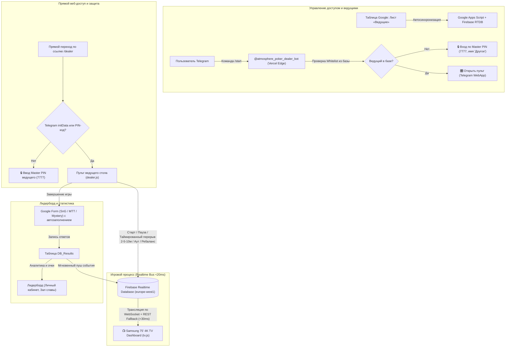

# 🧭 ORCHESTRATOR: Генеральный протокол качества 9.5/10 и архитектурный план
Покерная экосистема «Атмосфера» (ТВ-дашборд 4K, Telegram Mini App ведущего, бот авторизации, Firebase RTDB, Google Таблицы, Google Apps Script, Vercel Edge)

---

## 1. Архитектура системы и карта узлов

---

## 2. Спецификация турнирных форматов и структур

1. **🃏 SnG (SNG_STANDARD — 5 000 стек, 7 мин):**
   * 0 встроенных перерывов в сетке уровней.
   * Уровни: 1: 25/50, 2: 50/100, 3: 75/150, 4: 100/200, 5: 150/300, 6: 200/400 (BBA 400), 7: 300/600 (BBA 600), 8: 500/1000 (BBA 1000), 9: 800/1600 (BBA 1600), 10: 1000/2000 (BBA 2000).
   * Google Form: `https://docs.google.com/forms/d/e/1FAIpQLSfCfnN2LS4mAmbQfPtBLZGxPoiYfSqNoaX5xLrmyBr3S5FiEg/viewform`.

2. **🏰 SnG Deep (SNG_DEEP_1500 — 1 500 стек, 10 мин):**
   * 0 встроенных перерывов, без анте.
   * Уровни: 1: 5/10, 2: 10/25, 3: 25/50, 4: 50/100, 5: 100/200, 6: 200/400, 7: 400/800, 8: 800/1600, 9: 1000/2000.
   * Google Form: `https://docs.google.com/forms/d/e/1FAIpQLSfCfnN2LS4mAmbQfPtBLZGxPoiYfSqNoaX5xLrmyBr3S5FiEg/viewform`.

3. **🏆 MTT (Многостоловой турнир):**
   * Google Form: `https://docs.google.com/forms/d/e/1FAIpQLSeIDDkj2iCPtMZm-0K5YdZFlopAR7aPfRer2n1o-FQD-Dr7FQ/viewform`.
   * МТТ-движок: учет участников, ауты, умный ребаланс боксов, сводный TV-виджет.

4. **🎯 Mystery Bounty:**
   * Google Form: `https://docs.google.com/forms/d/e/1FAIpQLScFJXRH7bgb2W2aCOeSAKYfL-m4odE14HM5a2eWGz8to4QIlA/viewform`.
   * Учет нокаутов и баунти-очков.

---

## 3. Чеклист задач спринта до планки 9.5/10 (Quality Action Plan)

Каждый блок состоит из строго парных задач: **[ ] TASK-... (Реализация)** $\rightarrow$ **[ ] VERIFY-... (Сквозная E2E проверка и деплой)**.

---

### 🔒 Фаза 1. Безопасность, изоляция секретов и ликвидация спама
* [x] **TASK-1.1:** Изоляция токенов, чистка репозитория и защита от утечек
* [x] **VERIFY-1.1:** Тест безопасности и изоляции секретов (`tests/test_security_sanitization.js`)
* [x] **TASK-1.2:** Гарантированное устранение спама и сброс очереди апдейтов
* [x] **VERIFY-1.2:** Тест тишины бота и защиты от шторма вебхуков (`tests/test_bot_silence_and_dedup.js`)

---

### 👤 Фаза 2. Автоопределение ведущего и чистые структуры игры
* [x] **TASK-2.1:** Бесшовное автоопределение дилера без ручного выбора
* [x] **VERIFY-2.1:** Тест автоопределения ведущего в браузере и Telegram (`tests/test_dealer_identity_guard.js`)
* [x] **TASK-2.2:** Первичное обновление структур (7 мин стандарт и классика)
* [x] **VERIFY-2.2:** Тест структур блайндов и таймингов (`tests/test_structures_and_breaks.js`)

---

### 🏆 Фаза 3. МТТ-движок: ауты, рассадка, ребаланс боксов и ТВ-дашборд
* [x] **TASK-3.1:** Пульт дилера для МТТ: ввод участников, кнопка «Аут» и ребаланс боксов
* [x] **VERIFY-3.1:** Тест МТТ логики аутов и пересадки (`tests/test_mtt_balancing_engine.js`)
* [x] **TASK-3.2:** ТВ-дашборд 4K для МТТ: виджет игроков, средний стек и баннер пересадки
* [x] **VERIFY-3.2:** Визуальный E2E тест МТТ дашборда 4K в браузере (`tests/test_tv_mtt_dashboard.js`)

---

### 🧹 Фаза 4. Чистка мертвого кода, ревизия репозитория и документация
* [x] **TASK-4.1:** Удаление мертвого кода и неиспользуемых артефактов
* [x] **VERIFY-4.1:** Аудит чистоты кодовой базы (`tests/test_config_diagnostics.js`)

---

### 🚀 Фаза 5. Регрессионный сьют и Vercel Deployment
* [x] **TASK-5.1:** Полный сквозной прогон всех тестов
* [x] **VERIFY-5.1:** Конфигурация `vercel.json` и релизный деплой

---

### 💎 Фаза 6. Защита прямого доступа, динамический реестр ведущих, чистые структуры и таймированные паузы
* [x] **TASK-6.1:** Защита пульта от несанкционированного прямого доступа (PIN / WebApp Guard)
* [x] **VERIFY-6.1:** Тест защиты прямого доступа (`tests/test_dealer_security_pin_guard.js`)
* [x] **TASK-6.2:** Динамический реестр ведущих через Google Таблицу и чистка Firebase
* [x] **VERIFY-6.2:** Тест динамического реестра и чистоты Firebase (`tests/test_dynamic_dealers_sync.js`)
* [x] **TASK-6.3:** Обновление турнирных структур (0 перерывов в сетке) и структура 1 500 фишек
* [x] **VERIFY-6.3:** Тест чистых структур 5000 и 1500 фишек (`tests/test_structures_v2.js`)
* [x] **TASK-6.4:** Быстрые таймированные паузы в пульте (2 мин / 5 мин / 10 мин) и ТВ-таймер
* [x] **VERIFY-6.4:** Тест таймированных пауз на пульте и ТВ 4K (`tests/test_timed_pauses.js`)
* [x] **TASK-6.5:** Формы по форматам (SnG/MTT/Mystery) и имя «Другое» для гостей
* [x] **VERIFY-6.5:** Тест маршрутизации форм и гостевой авторизации (`tests/test_forms_and_guest_pin_auth.js`)

---

### ⚡️ Фаза 7. Сетевая надежность, оффлайн-устойчивость и кэширование Leaderboard

#### [x] TASK-7.1. Оффлайн-устойчивость пульта (PendingQueue) и абсолютные тайминги
* **Что делаем:**
  * В `dealer/dealer.js` добавить очередь отложенной отправки запросов (`atmosphere_pending_queue`) в `localStorage` при сбоях связи (в подвале/лифте).
  * Базировать таймер исключительно на абсолютных миллисекундах `levelEndsAt` и `pauseEndsAt`, гарантируя точность до секунды при сворачивании и разворачивании Telegram.
* **Файлы:** `dealer/dealer.js`

#### [x] VERIFY-7.1. E2E Тест оффлайн-очереди и фоновой синхронизации
* **Проверка:** Написать автотест `tests/test_dealer_offline_resilience.js` (эмуляция отключения сети, запись состояний и авто-сброс очереди при восстановлении связи).

---

#### [ ] TASK-7.2. Vercel Edge Proxy для лидерборда и мгновенный пуш из таблицы
* **Что делаем:**
  * В `api/leaderboard.js` реализовать легковесный Serverless Proxy к Google Apps Script с заголовками `s-maxage=60, stale-while-revalidate=300` для ультрабыстрого отклика (<50ms) без CORS-ошибок.
  * В `index.html` переключить `DEFAULT_API` на `/api/leaderboard`.
  * В `Code.js` (`processFormSubmit`) добавить триггерный пуш события обновления в Firebase RTDB `/atmosphere/leaderboard_updated_at`.
* **Файлы:** `api/leaderboard.js`, `index.html`, `Code.js`, `FirebaseSync.js`

#### [ ] VERIFY-7.2. Тест Edge Proxy и событийного обновления лидерборда
* **Проверка:** Автотест `tests/test_edge_leaderboard_proxy.js` (проверка кэширования, ответа Proxy и формата данных).

---

### 📺 Фаза 8. ТВ-дашборд 4K: Резервный транспорт данных и овертайм-анимации

#### [ ] TASK-8.1. Двойной транспорт данных (WebSocket + REST Polling fallback) для Smart TV
* **Что делаем:**
  * В `tv/tv.js` реализовать автоматический fallback на периодический REST-опрос (`fetch('/atmosphere/tables.json')` раз в 1.5 сек), если Firebase JS SDK заблокирован браузером ТВ или отвалился WebSocket.
  * Добавить визуальную пульсацию и ненавязчивый звуковой сигнал в режиме овертайма (когда таймер ушел в минус).
* **Файлы:** `tv/tv.js`, `tv/styles.css`

#### [ ] VERIFY-8.1. Тест отказоустойчивости ТВ-дашборда
* **Проверка:** Автотест `tests/test_tv_transport_resilience.js` (симуляция падения WebSocket и успешного переключения на REST).

---

### 🎲 Фаза 9. Умный МТТ ребаланс и исключение выбывших мест

#### [ ] TASK-9.1. Исключение пустых боксов при ребалансе столов
* **Что делаем:**
  * В `dealer/dealer.js` генерировать случайный номер бокса только из диапазона реально занятых мест на столе (на основе `table.playersCount`), с возможностью мгновенного реролла.
* **Файлы:** `dealer/dealer.js`

#### [ ] VERIFY-9.1. Тест логики ребаланса с учетом живых игроков
* **Проверка:** Автотест `tests/test_mtt_smart_rebalance.js`.

---

### 🏁 Фаза 10. Финальная ревизия, чистка и релиз 9.5/10

#### [ ] TASK-10.1. Полная ревизия кодовой базы, удаление мертвого кода и запуск всех тестов
* **Что делаем:**
  * Аудит всех неиспользуемых файлов и переменных.
  * Прогон мастер-раннера `tests/run_all_tests.js` (33+ теста).
  * Деплой в Google Apps Script и Vercel Production.
* **Файлы:** `scripts/deploy_apps_script.js`, `vercel.json`

#### [ ] VERIFY-10.1. Фиксация эталонного качества 9.5/10
* **Проверка:** Полный прогон `node tests/run_all_tests.js` с результатом 100% PASSED.

---

## 4. Протокол работы автономного агента (Autonomous Loop Rules)

1. **Строгая попарность:** Исполнитель берет ровно одну незакрытую задачу `[ ] TASK-...`, реализует её, затем **ОБЯЗАТЕЛЬНО** берет парную `[ ] VERIFY-...` и запускает автотест.
2. **Никакой грязи в Git:** После каждого выполненного шага делается Git коммит и push.
3. **Обновление статуса:** Выполненная задача отмечается как `[x]` в `ORCHESTRATOR.md`.
4. **Контроль планки 9.5/10:** Полная согласованность фронтенда, бэкенда, Firebase и Google Таблиц.
