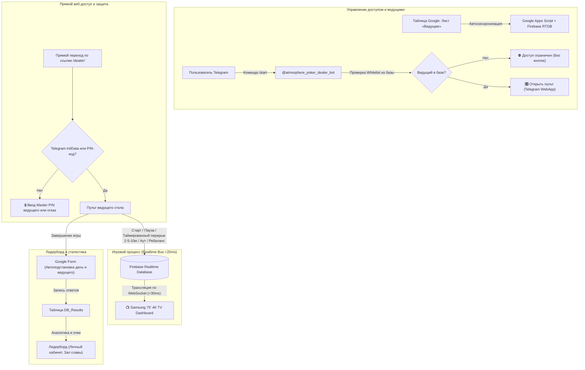

# 🧭 ORCHESTRATOR: Генеральный протокол качества 9.5/10 и архитектурный план
Покерная экосистема «Атмосфера» (ТВ-дашборд 4K, Telegram Mini App ведущего, бот авторизации, Firebase RTDB, Google Таблицы, Google Apps Script, Vercel)

---

## 1. Архитектура системы и карта узлов

---

## 2. Глубокий аудит системы: проблемы, нелогичности и решения

### 🚨 1. Защита от прямого доступа и безопасность пульта
* **Проблема:** Если посторонний человек переходил по прямой ссылке на `/dealer/` вне Telegram, система по умолчанию присваивала имя «Влад» и открывала полный контроль над столом №1.
* **Решение:**
  1. Внедрить двухуровневый шлюз авторизации:
     * **Telegram WebApp:** автоматическая верификация через `Telegram.WebApp.initDataUnsafe` с проверкой по реестру ведущих.
     * **Прямой браузер (десктоп / ТВ / локальный тест):** защитный экран с вводом мастер-PIN-кода ведущего.
  2. Без успешной авторизации пульт полностью заблокирован.

### 👥 2. Динамическое управление ведущими без правок в коде
* **Проблема:** Добавление или удаление ведущего требовало редактирования исходного кода и передеплоя. В Firebase скопились устаревшие мок-столы (`dealer_igor`, `dealer_sergey`, `dealer_drugoe`, `dealer_evgeniy`, `dealer_ведущий`).
* **Решение:**
  1. В Google Таблице создать лист `Ведущие` с колонками `[Имя | Telegram @username | Telegram ID | Статус (Активен/Заблокирован)]`.
  2. В Google Apps Script реализовать функцию `syncDealersToFirebase()`, выгружающую актуальный список в узел `/atmosphere/dealers_registry.json`.
  3. Бот `DealerBot.js` и пульт `dealer/dealer.js` обращаются к динамическому реестру.
  4. Запустить процедуру очистки Firebase от фантомных столов.

### 🃏 3. Турнирные структуры без перерывов и классическая сетка 1500 фишек
* **Проблема:** В структуре блайндов находился встроенный раунд перерыва с некорректным колор-апом. Для размена фишек ведущие делают ручную паузу.
* **Решение:**
  1. **Структура 1 (SNG_STANDARD — 5 000 стек, 7 мин):**
     * Полное отсутствие раундов-перерывов в сетке.
     * Уровни: 1: 25/50, 2: 50/100, 3: 75/150, 4: 100/200, 5: 150/300, 6: 200/400 (BBA 400), 7: 300/600 (BBA 600), 8: 500/1000 (BBA 1000), 9: 800/1600 (BBA 1600), 10: 1000/2000 (BBA 2000).
  2. **Структура 2 (SNG_DEEP_1500 — 1 500 стек, 10 мин, без анте):**
     * Уровни: 1: 5/10, 2: 10/25, 3: 25/50, 4: 50/100, 5: 100/200, 6: 200/400, 7: 400/800, 8: 800/1600, 9: 1000/2000.

### ⏱ 4. Быстрые таймированные паузы (2 мин / 5 мин / 10 мин)
* **Проблема:** Обычная пауза не показывает оставшееся время до возобновления игры при размене фишек (color-up) или перерыве.
* **Решение:**
  1. На пульте ведущего добавить кнопки быстрых пауз: `[ ⏱ 2 мин (Color-Up) ]`, `[ ⏱ 5 мин ]`, `[ ⏱ 10 мин ]`.
  2. При нажатии включается таймированная пауза:
     * На пульте дилера отображается живой обратный отсчет паузы с кнопкой `[ ▶️ Возобновить ]`.
     * На 4K ТВ-дашборде карточка стола переходит в янтарный режим `☕ ПЕРЕРЫВ (РАЗМЕН ФИШЕК)` с крупным таймером.
     * По истечении времени подается звуковой сигнал на ТВ и вибрация на пульт.

### 🏆 5. МТТ-движок: ауты, рассадка, ребаланс боксов и ТВ-дашборд
* **Пульт ведущего:** Управление игроками `+` / `−`, быстрая кнопка `[ 💀 Аут игрока (-1) ]`.
* **Умный ребаланс:** При дельте $\ge 2$ между столами генерируется алерт со случайным боксом `1..10`, кнопками реролла и подтверждения пересадки.
* **ТВ-дашборд 4K:** Верхний бар (всего игроков `X/Y`, средний стек `Total Chips / Players`, активных столов) и тикер-баннеры пересадки / финала.

---

## 3. Чеклист задач спринта до планки 9.5/10 (Quality Action Plan)

Каждый блок состоит из парных задач: **[ ] TASK-... (Реализация)** $\rightarrow$ **[ ] VERIFY-... (Сквозная проверка и деплой)**.

---

### 🔒 Фаза 1. Безопасность, изоляция секретов и ликвидация спама
* [x] **TASK-1.1:** Изоляция токенов, чистка репозитория и защита от утечек
* [x] **VERIFY-1.1:** Тест безопасности и изоляции секретов (`tests/test_security_sanitization.js`)
* [x] **TASK-1.2:** Гарантированное устранение спама и сброс очереди апдейтов
* [x] **VERIFY-1.2:** Тест тишины бота и защиты от шторма вебхуков (`tests/test_bot_silence_and_dedup.js`)

---

### 👤 Фаза 2. Автоопределение ведущего и чистые структуры игры
* [x] **TASK-2.1:** Бесшовное автоопределение дилера без ручного выбора
* [x] **VERIFY-2.1:** Тест автоопределения ведущего в браузере и Telegram (`tests/test_dealer_identity_guard.js`)
* [x] **TASK-2.2:** Первичное обновление структур (7 мин стандарт и классика)
* [x] **VERIFY-2.2:** Тест структур блайндов и таймингов (`tests/test_structures_and_breaks.js`)

---

### 🏆 Фаза 3. МТТ-движок: ауты, рассадка, ребаланс боксов и ТВ-дашборд
* [x] **TASK-3.1:** Пульт дилера для МТТ: ввод участников, кнопка «Аут» и ребаланс боксов
* [x] **VERIFY-3.1:** Тест МТТ логики аутов и пересадки (`tests/test_mtt_balancing_engine.js`)
* [x] **TASK-3.2:** ТВ-дашборд 4K для МТТ: виджет игроков, средний стек и баннер пересадки
* [x] **VERIFY-3.2:** Визуальный E2E тест МТТ дашборда 4K в браузере (`tests/test_tv_mtt_dashboard.js`)

---

### 🧹 Фаза 4. Чистка мертвого кода, ревизия репозитория и документация
* [x] **TASK-4.1:** Удаление мертвого кода и неиспользуемых артефактов (удален `bot/dealer-bot.js`)
* [x] **VERIFY-4.1:** Аудит чистоты кодовой базы (`tests/test_config_diagnostics.js`)

---

### 🚀 Фаза 5. Регрессионный сьют и Vercel Deployment
* [x] **TASK-5.1:** Полный сквозной прогон всех тестов (19 из 19 тестов PASSED)
* [x] **VERIFY-5.1:** Конфигурация `vercel.json` и релизный деплой

---

### 💎 Фаза 6. Защита прямого доступа, динамический реестр ведущих, чистые структуры и таймированные паузы

#### [x] TASK-6.1. Защита пульта от несанкционированного прямого доступа (PIN / WebApp Guard)
* **Что делаем:**
  * В `dealer/dealer.js`: если страница открыта вне Telegram WebApp и нет `initDataUnsafe`, отображать модальное окно авторизации с просьбой войти через бота или ввести Master PIN (задается в `POKER_CONFIG` / `PropertiesService`).
  * Запретить автоматический вход под учетной записью «Влад» при прямом переходе по ссылке.
* **Файлы:** `dealer/dealer.js`, `dealer/index.html`, `dealer/styles.css`

#### [x] VERIFY-6.1. Тест защиты прямого доступа
* **Проверка:** Автотест `tests/test_dealer_security_pin_guard.js` (проверка блокировки неавторизованного браузера и успешного входа по PIN). Git commit.

---

#### [x] TASK-6.2. Динамический реестр ведущих через Google Таблицу и чистка Firebase
* **Что делаем:**
  * В Google Apps Script (`Code.js`, `Config.js`, `FirebaseSync.js`) реализовать создание/чтение листа `Ведущие` и автосинхронизацию в Firebase `/atmosphere/dealers_registry.json`.
  * Создать скрипт `scripts/purge_firebase_mock_tables.js` для удаления фантомных столов (`dealer_igor`, `dealer_sergey`, `dealer_drugoe`, `dealer_evgeniy`, `dealer_ведущий`).
  * В `dealer/dealer.js` и `DealerBot.js` подключить динамическую загрузку реестра из Firebase / Apps Script.
* **Файлы:** `Config.js`, `FirebaseSync.js`, `Code.js`, `scripts/purge_firebase_mock_tables.js`, `shared/poker-config.js`

#### [x] VERIFY-6.2. Тест динамического реестра и чистоты Firebase
* **Проверка:** Автотест `tests/test_dynamic_dealers_sync.js` (проверка чтения реестра из таблицы и чистоты Firebase RTDB). Git commit & push.

---

#### [ ] TASK-6.3. Обновление турнирных структур (0 перерывов в сетке) и структура 1 500 фишек (10 мин)
* **Что делаем:**
  * В `shared/poker-config.js`, `Config.js`, `dealer/index.html`:
    1. `SNG_STANDARD`: 5 000 стек, 7 мин уровни, **0 перерывов в массиве уровней** (10 уровней с BBA со 6-го уровня: 25/50, 50/100, 75/150, 100/200, 150/300, 200/400 (400), 300/600 (600), 500/1000 (1000), 800/1600 (1600), 1000/2000 (2000)).
    2. `SNG_DEEP_1500`: 1 500 стек, 10 мин уровни, **без анте** (9 уровней: 5/10, 10/25, 25/50, 50/100, 100/200, 200/400, 400/800, 800/1600, 1000/2000).
* **Файлы:** `shared/poker-config.js`, `Config.js`, `dealer/index.html`, `dealer/dealer.js`

#### [ ] VERIFY-6.3. Тест чистых структур 5000 и 1500 фишек
* **Проверка:** Автотест `tests/test_structures_v2.js` (проверка блайндов, отсутствия встроенных пауз и корректных таймингов). Git commit.

---

#### [ ] TASK-6.4. Быстрые таймированные паузы в пульте (2 мин / 5 мин / 10 мин) и ТВ-таймер
* **Что делаем:**
  * В `dealer/index.html` и `dealer/dealer.js`:
    * Панель быстрых пауз: `[ ⏸ Пауза ]`, `[ ⏱ 2 мин ]` (быстрый Color-Up), `[ ⏱ 5 мин ]`, `[ ⏱ 10 мин ]`.
    * Сохранение `pauseEndsAt` в состояние стола.
    * Живой таймер обратного отсчета паузы на экране ведущего.
  * В `tv/tv.js` и `tv/styles.css`:
    * Отображение карточки стола в режиме перерыва с обратным отсчетом `☕ ПЕРЕРЫВ (01:45)`.
    * Звуковое оповещение и виброотклик по окончании таймера паузы.
* **Файлы:** `dealer/index.html`, `dealer/dealer.js`, `dealer/styles.css`, `tv/tv.js`, `tv/styles.css`

#### [ ] VERIFY-6.4. Тест таймированных пауз на пульте и ТВ 4K
* **Проверка:** Автотест `tests/test_timed_pauses.js` (симуляция пауз 2 мин и 5 мин, проверка передачи в Firebase и отображения на ТВ). Git commit & push.

---

#### [ ] TASK-6.5. Финальный прогон полного мастер-сьюта тестов и релизный деплой v110
* **Что делаем:**
  * Запуск `node tests/run_all_tests.js` (все тесты).
  * Деплой Google Apps Script v110.
  * Синхронизация с Vercel и GitHub Pages.
* **Файлы:** `scripts/deploy_apps_script.js`, `scripts/fix_deployment_access.js`

#### [ ] VERIFY-6.5. Фиксация планки качества 9.5/10
* **Проверка:** Все 23+ теста пройдены, репозиторий чист, live-сервисы активны.

---

## 4. Протокол работы исполнителя (Autonomous Loop Rules)

1. **Строгая попарность:** Исполнитель берет ровно одну незакрытую задачу `[ ] TASK-...`, реализует её до идеала, затем **ОБЯЗАТЕЛЬНО** берет парную `[ ] VERIFY-...` и запускает автотест.
2. **Никакой грязи в Git:** После каждого выполненного шага делается Git коммит и push.
3. **Обновление статуса:** Выполненная задача отмечается как `[x]` в `ORCHESTRATOR.md`.
4. **Контроль планки 9.5/10:** Полная согласованность фронтенда, бэкенда, Firebase и Google Таблиц.
