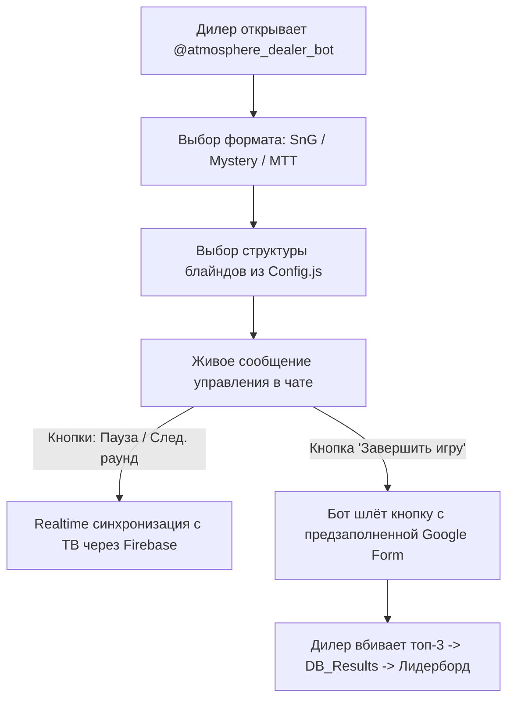

# 🏛 Генеральный регламент и архитектура покерной системы — Антикафе «Атмосфера»

Документ является единым источником правды для клубной системы автоматизации турниров, вывода на 75" 4K экран и управления через закрытый Telegram-бот дилеров.

---

## 1. Контекст и регламент турниров

### 1.1. Форматы и регулярность
* **SnG (Sit & Go):** 95%+ игровых дней. Одновременно от 1 до 4 параллельных столов со сдвигом по времени старта.
* **Mystery Bounty:** 1 раз в месяц (заменяет одну из SnG-игр, идентичная структура блайндов).
* **MTT:** 1 раз в месяц (целый день, отдельная глубокая структура).

### 1.2. Стандартный стек и структура (SnG / Mystery Bounty)
* **Стартовый стек:** **5 000 фишек (100 BB со старта)**.
* **Выдача фишек (19 шт на игрока — выдача за 7 секунд):**
  * $1000 \times 3 = 3000$
  * $500 \times 2 = 1000$
  * $100 \times 8 = 800$
  * $50 \times 2 = 100$
  * $25 \times 4 = 100$
  * *(Номиналы $5 и $10 полностью исключены)*.
* **Сетка блайндов (уровни по 7 минут, таргет 70–75 мин):**
  * **L1:** `25 / 50` (100 BB) — 7 мин
  * **L2:** `50 / 100` (50 BB) — 7 мин
  * **L3:** `75 / 150` (33.3 BB) — 7 мин
  * **L4:** `100 / 200` (25 BB) — 7 мин
  * **L5:** `150 / 300` (16.6 BB) — 7 мин
  * ☕️ **Перерыв 5 мин + Color-Up** (размен и удаление фишек $25 и $50 со стола)
  * **L6:** `200 / 400 + BBA 400` (12.5 BB) — 7 мин *(Включение Big Blind Ante)*
  * **L7:** `300 / 600 + BBA 600` (8.3 BB) — 7 мин
  * **L8:** `500 / 1000 + BBA 1000` (5.0 BB) — 7 мин
  * **L9:** `800 / 1600 + BBA 1600` (3.1 BB) — 6 мин
  * **L10:** `1000 / 2000 + BBA 2000` (2.5 BB) — 6 мин *(Хэдз-ап / Гарантированный финиш)*

---

## 2. Аппаратное обеспечение и окружение

* **Экран в зале:** Телевизор **SAMSUNG UE75TU7100UXRU** (75 дюймов, 4K UHD, 3840×2160).
* **Звук в зале:** Колонка JBL + фоновая Яндекс Музыка.
* **Аудио-регламент:** Страница на ТВ работает **100% без звуков**, чтобы не перехватывать Audio Focus на Android TV/Tizen и не глушить фоновую музыку. Все оповещения — строго визуальные.
* **Сеть:** Локальный Wi-Fi антикафе.

---

## 3. Логика экрана на ТВ (Smart TV Display)

### 3.1. Идентификация столов
* **Без абстрактных номеров:** столы подписываются по имени ведущего: **«Стол ведущего Влад»**, **«Стол ведущего Арина»**.
* Имя автоматически подтягивается из Telegram дилера.

### 3.2. Адаптивная 4K сетка (от 1 до 4 столов одновременно)
* **1 стол:** полноэкранный режим (крупный таймер и блайнды).
* **2 стола:** сплит 50/50 (левый / правый стол).
* **3 стола:** 3 колонки (по 33% ширины 4K экрана).
* **4 стола:** сетка 2x2 (4 квадранта по 37.5 дюймов каждый). Все столы видны 100% времени.

### 3.3. Визуальный алерт смены блайндов
* Когда на столе до конца раунда остаётся $\le 45$ секунд — рамка карточки стола мягко подсвечивается янтарным цветом, предупреждая дилера и игроков.

### 3.4. Окончание игры и межтурнирный перерыв
* По завершении игры карточка стола на ТВ переходит в режим:
  * Заголовок: *«Игра завершена (Стол ведущего Влад)»*.
  * **Регламентированный таймер обратного отсчёта до следующей игры (10:00 $\rightarrow$ 00:00)**.
  * Выбывшие игроки чётко знают, сколько у них времени на перекус/курилку.

---

## 4. Пульт управления дилера (Telegram-бот `@atmosphere_dealer_bot`)

Управление реализовано **нативно прямо в чате Telegram через Inline-кнопки** (без необходимости открывать сайты или Mini App).



### 4.1. Сценарий запуска игры:
1. Дилер пишет `/start` (или нажимает «Новая игра»).
2. Бот предлагает кнопки выбора формата: `[ SnG ]` | `[ Mystery Bounty ]` | `[ MTT ]`.
3. Бот предлагает выбор структуры из `Config.js`: `[ 5000 стек / 7 мин ]` | `[ 5000 стек / 5 мин (Турбо) ]`.
4. Стол моментально стартует на ТВ.

### 4.2. Живое сообщение управления в чате:
Бот присылает сообщение, которое динамически обновляется при нажатии кнопок:
```text
♠️ СТОЛ ВЕДУЩЕГО ВЛАД
───────────────────────────
🏆 Формат: SnG (5 000 фишек / 100 BB)
⏱ Раунд 1: 25 / 50 (след. 50 / 100)
🟢 Статус: ИДЁТ ИГРА (осталось 06:15)
───────────────────────────
[ ⏸ Пауза ]   [ ⏩ След. раунд ]
[ ❌ Сбросить запуск ]  <-- (исчезает через 3 мин!)
[ 🏁 Завершить игру ]
```

### 4.3. Защита от случайной отмены:
* Кнопка `[ ❌ Сбросить запуск ]` отображается **только первые 3 минуты** 1-го раунда.
* Через 3 минуты (или при переходе на 2-й раунд) кнопка отмены навсегда пропадает, исключая случайный сброс активной игры.

### 4.4. Завершение игры и предзаполненная Google Form:
1. Дилер жмёт `[ 🏁 Завершить игру ]`.
2. На ТВ включается 10-минутный перерыв.
3. Бот мгновенно формирует предзаполненную ссылку:
   `https://docs.google.com/forms/d/e/.../viewform?entry.date=2026-09-01&entry.dealer=Влад`
4. Дилеру приходит кнопка: `[ 📝 Внести результаты игры ]`.
5. Дилер открывает форму (дата и имя уже стоят), выбирает 1, 2, 3 места и жмёт «Отправить».
6. Триггер `onFormSubmit` в Apps Script вносит строки в `DB_Results` и пересчитывает Лидерборд.

---

## 5. Технический стек и инфраструктура

| Компонент | Технология | Стоимость |
| :--- | :--- | :---: |
| **Экран на ТВ** | HTML5 + CSS3 + JS (чистый статический Kiosk) | **0 ₽ / мес** |
| **Хостинг экрана** | Cloudflare Pages / GitHub Pages | **0 ₽ / мес** |
| **Шина данных (Таймеры)** | Firebase Realtime Database (Google Spark Plan) | **0 ₽ / мес** |
| **Бот персонала** | `@atmosphere_dealer_bot` (Google Apps Script Webhook) | **0 ₽ / мес** |
| **База данных и логика** | Google Sheets + Google Apps Script (`DB_Results`, `Leaderboard`) | **0 ₽ / мес** |
| **ИТОГО** | Полностью автономное решение без платных подписок | **0 ₽ / мес** |